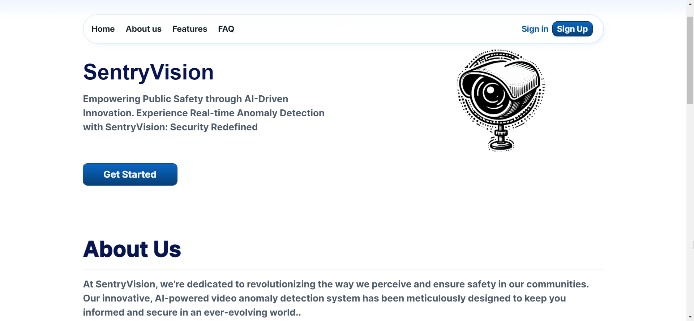
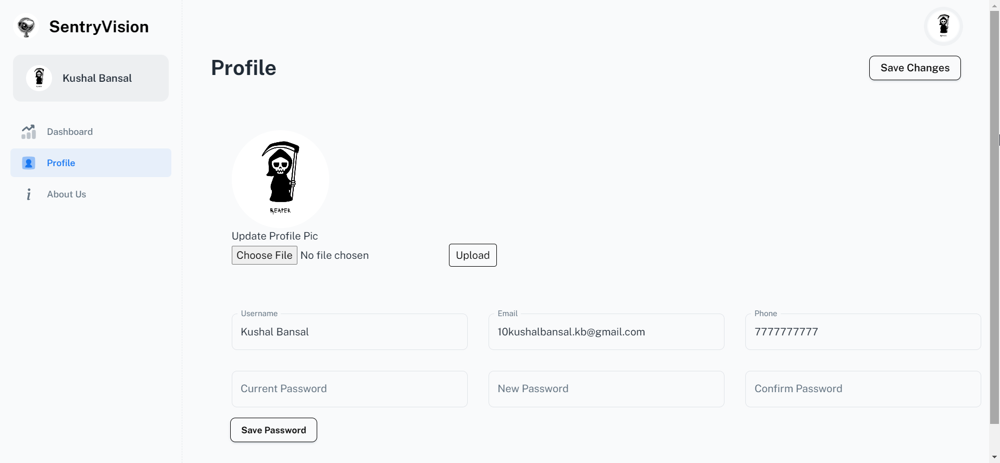

## SentryVision
Empowering Public Safety through AI-Driven Innovation

## About
SentryVision is an innovative real-time video anomaly detection system designed to enhance security and safety in public spaces. Leveraging advanced Artificial Intelligence (AI) and Machine Learning (ML) technologies, SentryVision identifies various anomalies such as fights, road accidents, and explosions, ensuring immediate notification to end-users through email alerts.

### Key features
- ```Real-time Anomaly Detection```: SentryVision utilizes cutting-edge AI and ML algorithms to identify and analyze anomalies in real-time, ensuring prompt response to potential threats.
- ```Instant Email Notifications```: In the event of an anomaly detection, SentryVision sends immediate email notifications to registered users, providing them with crucial information and video evidence of the incident.
- ```Video Footage and Timestamp Recording```: SentryVision records the detected video footage along with timestamps, enabling users to review incidents, assess potential risks, and take necessary actions.

### Tech Stack
- Python
- Flask
- React JS
- Vite JS
- TensorFlow

### Get Started
- Clone the SentryVision repository to your local machine.
- Navigate to the ```Backend``` directory in VS Code.
- Create a database according to the given schema: ```Backend\prisma\schema.prisma``` 
- Configure the environment variables in the ```Backend\config\config.py```
- Create a virtual environment: ```python -m venv venv```
- Install the python dependencies in ```requirements.txt``` by runnning ```pip install -r requirements.txt```
- Start the Backend server by running ```flask run --debug```
- Open another VS code instance and navigate to the  ```Frontend``` directory
- Install dependencies by running ```npm install```
- Start the Frontend server by running ```npm run dev```

### SentryVision UI


#### Landing Page:


#### Dashboard Page:


#### Profile Page:


#### About Us Page:


### Contributors:

<a href="https://github.com/Piyush-Raj-Tiwari" title="Piyush-Raj-Tiwari" style="text-decoration: none;">
    
</a>
<a href="https://github.com/Hannah2k23" title="Hannah2k23" style="text-decoration: none;">
    
</a>
<a href="https://github.com/bhagat-2306" title="bhagat-2306" style="text-decoration: none;">
    
</a>

### Contact
If you have any questions or need assistance with SentryVision, please contact us at mailto:sentryvision112@gmail.com. We are always happy to help!

### License
This project is licensed under the MIT License - see the [LICENSE](LICENSE) file for details.
